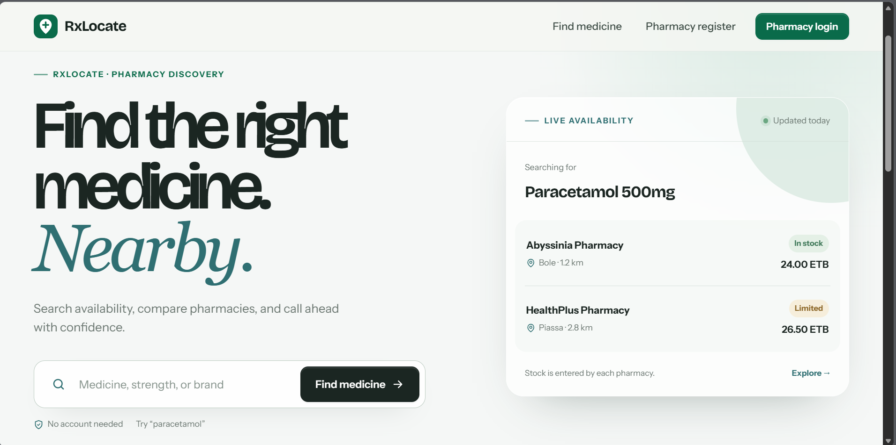

<div align="center">

# RxLocate

**A pharmacy inventory and medicine-discovery platform for Ethiopia.** Patients can search medicine availability across pharmacies, while pharmacy teams manage stock, sales, and operational reporting from one workspace.


[Architecture](docs/architecture.md) · [API specification](docs/openapi.yaml)

</div>

## Product overview

Medicine availability is often fragmented across pharmacies. A patient may need to call several locations before finding a medicine in stock. RxLocate addresses that problem with a shared discovery experience for patients and an inventory workspace for pharmacies. The project also exposes the same lookup flow through USSD for low-connectivity and feature-phone use cases.

## Product preview



The screenshot shows the patient-facing discovery experience: a medicine query, stock status, price, pharmacy location, and a clear path to contact or visit the pharmacy.

## Core capabilities

| Area | Capability |
| --- | --- |
| **Patient discovery** | Case-insensitive medicine search with live availability, pricing, pharmacy contact details, and map links. |
| **Pharmacy workspace** | Registration, BCrypt password hashing, inventory CRUD, quick stock adjustments, and pharmacy-scoped access checks. |
| **Inventory health** | Low-stock, out-of-stock, and expired-medicine tracking with operational attention states. |
| **Sales and reporting** | Sale recording with atomic stock decrement, realized revenue and gross-profit tracking, inventory value, and monthly or all-time reporting. |
| **USSD access** | The medicine lookup is available through a `CON`/`END` USSD menu at `POST /api/ussd`. |
| **REST API** | Medicine search is available at `GET /api/medicines/search` and documented in [`docs/openapi.yaml`](docs/openapi.yaml). |

## Technical highlights

RxLocate is a layered Spring Boot monolith. Controllers coordinate HTTP requests, services hold business rules, repositories handle persistence, and Thymeleaf templates render the web interface. Dashboard metrics are built from a shared read-only snapshot so that inventory, sales, and reporting views use consistent calculations.

The application separates unit cost from selling price. This allows it to distinguish current inventory value and potential profit from realized revenue and gross profit recorded through completed sales.

```text
Patient browser     Pharmacy browser     REST client     USSD gateway
      |                    |                  |                |
      +--------------------+------------------+----------------+
                            |
                 Controllers (web + REST + USSD)
                            |
        Services — MedicineService · SaleService · PharmacyDashboardService
                            |
             Domain — Pharmacy · Medicine · Sale
                            |
                Spring Data JPA repositories
                            |
                     MySQL / H2
```

See the [architecture notes](docs/architecture.md) for the domain model, reporting decisions, and ownership rules.

## Technology stack

- **Backend:** Java 21, Spring Boot 4, Spring MVC, Spring Data JPA, and Spring Security Crypto with BCrypt.
- **Frontend:** Thymeleaf, vanilla CSS, and vanilla JavaScript.
- **Data:** MySQL for the full profile; file-based H2 for the demo profile and H2 for tests.
- **Delivery:** Maven, Docker Compose, and GitHub Actions.

## Run the demo locally

### Prerequisites

Install Java 21. The repository includes a Maven Wrapper, so Maven does not need to be installed separately.

### Start with demo data

```bash
./mvnw spring-boot:run -Dspring-boot.run.profiles=demo
```

Open `http://localhost:8080`. The patient experience is available at `/client`. The pharmacy login is available at `/pharmacy/login` with the demo account below.

| Account | Value |
| --- | --- |
| Username | `demo-pharmacy` |
| Password | `demo12345` |

The demo profile stores its data in `data/rxlocate-demo.mv.db`. To reset the demo data, stop the application and remove the `data/` directory before starting it again.

### Run tests

```bash
./mvnw test
```

The test suite uses an isolated H2 configuration and does not require a running MySQL instance.

### Run with MySQL or Docker Compose

```bash
cp .env.example .env
# Configure the values in .env, then run:
./mvnw spring-boot:run
```

Alternatively:

```bash
docker compose up --build
```

The `.env.example` file documents the environment variables used by the application. Production deployments should add a migration tool such as Flyway or Liquibase before relying on schema updates.

## API examples

Search for a medicine:

```bash
curl "http://localhost:8080/api/medicines/search?name=paracetamol"
```

Start a USSD lookup session:

```bash
curl -X POST "http://localhost:8080/api/ussd" \
  -d "sessionId=demo-session" \
  -d "text="
```

The complete API contract is available in [`docs/openapi.yaml`](docs/openapi.yaml) and can be viewed with [Swagger Editor](https://editor.swagger.io/).

## Project documentation

- [Architecture](docs/architecture.md)
- [Design direction](docs/design.md)
- [UX direction](docs/ux-direction.md)
- [Landing-page UX research](docs/LANDING-UX-RESEARCH.md)
- [OpenAPI specification](docs/openapi.yaml)

## Roadmap

The next improvements include pagination and availability filtering for patient search, validated request DTOs instead of direct entity binding, full CSRF protection for authenticated workflows, and browser-level integration tests.

## License

MIT. See [LICENSE](LICENSE).
